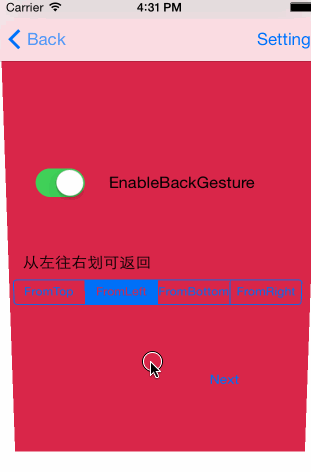

YRVCTransition
==========

Help to use the viewController transition iOS7 later

&nbsp;&nbsp;&nbsp;&nbsp;iOS7之后，苹果启用的新的VC视图切换动画方式，并且支持手势操作。  
&nbsp;&nbsp;&nbsp;&nbsp;很久以前就看过相关的资料，但是一直没有实际去使用，主要原因是考虑到最低支持的版本尚未达到iOS7，但是现在iOS8已经开放，预计在不久的将来还是会使用效果更好的方式，因此着手完成此库。

&nbsp;&nbsp;&nbsp;&nbsp;这里参考了ColinEberhardt的比较著名的库[VCTransitionsLibrary](https://github.com/ColinEberhardt/VCTransitionsLibrary)，并在此基础上做了一些调整。  

1.个人对动画的方向进行了全面的支持，上下左右都可以  
2.对手势操作进行了微调，目前是只支持NavigationController和ModelViewController，Tab的尚未考虑

###How to use
1.如果使用UINavigationController进行视图管理，需要调用

	#import "UINavigationController+YRVCTransition.h"
	...{
	...
    [navi bindYRTransitionDelegate];//开启动画效果
    
之后对于需要使用的动画，可以简单的使用
	
    YRVCTransitionMoveIn *moveIn = [YRVCTransitionMoveIn new];
    moveIn.parallaxRatio = 0.2;
    moveIn.direction = YRVCTransitionDirection_FromTop;
    [self.navigationController pushViewController:vc withYRVCTransition:moveIn];//category增加的方法
   
2.如果是不确定使用某种控制器，可以对UIViewController进行动画绑定

	#import "UINavigationController+YRVCTransition.h"
	#import "YRVCTransitionCube.h"
	@implementation ViewController
	- (id)initWithNibName:(NSString *)nibNameOrNil bundle:(NSBundle *)nibBundleOrNil{
    self = [super initWithNibName:nibNameOrNil bundle:nibBundleOrNil];
    if (self) {
        cube=[[YRVCTransitionCube alloc]init];//创建并绑定动画
        self.transition=cube;
    	}
    	return self;
	}
这样之后，可以使用标准的push方法，或者使用正常的presentModelViewController，都可以正常触发动画。

另外，如果启用了返回手势，各个view可以通过设置方向的滑动返回前一界面。

具体的效果可以参考demo，增加其他动画效果也比较简单。下面是效果图。

&nbsp;&nbsp;&nbsp;&nbsp;
	